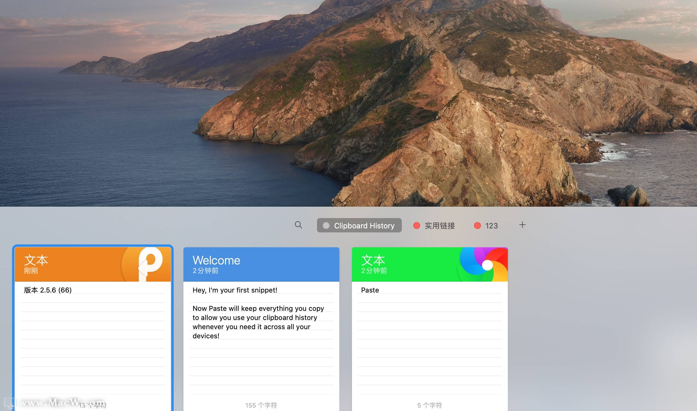

# Clipboard History App

Clipboard History 是一个功能强大的macOS剪贴板历史管理工具，允许用户随时查看、搜索和重用过去复制的内容，提高工作效率。该应用运行在状态栏，可通过快捷键快速访问，并支持丰富的自定义设置以满足个人需求。



## 主要功能

- **剪贴板监控**：实时监控系统剪贴板变化，自动保存所有复制的文本、图片和文件内容
- **历史管理**：
  - 按时间顺序显示剪贴板历史条目
  - 单击条目将其复制到活动剪贴板
  - 右键菜单提供更多操作选项（删除、收藏等）
  - 支持清空历史记录
- **标签管理**：
  - 创建自定义标签收藏常用内容
  - 通过拖拽重新排序收藏项
  - 多标签组织不同类型的剪贴板内容
- **快速搜索**：
  - 通过关键词在所有历史内容中快速查找
  - 支持跨标签全局搜索
- **分页加载**：
  - 高效处理大量剪贴板记录
  - 按需加载更多历史记录
- **键盘快捷键**：
  - 自定义显示/隐藏应用的全局快捷键（默认⌘⇧V）
  - 支持快捷键自定义，可设置显示剪贴板、清空历史、打开设置等操作的快捷键
  - 使用ESC键快速关闭界面
- **用户友好界面**：
  - 简洁现代的UI设计
  - 支持浅色/深色模式自动适配
  - 相对时间显示（例如"5分钟前"）
  - 优化的内容预览，支持多种数据类型
- **自定义设置**：
  - 调整最大历史条目数量（最多支持500条记录）
  - 设置开机自启动
  - 自定义键盘快捷键

## 安装方法

### 方法1：从DMG安装（推荐）

1. 下载最新的DMG安装文件：[Clipboard History.dmg](https://github.com/listar/clipboard-history-app/releases/latest)
2. 打开DMG文件
3. 将Clipboard History拖拽到Applications文件夹
4. 从Applications文件夹或Launchpad启动应用


## 系统要求

- macOS 12.0 (Monterey) 或更高版本
- 至少50MB可用磁盘空间
- 需要访问剪贴板的权限

## 使用教程

### 基本使用

1. 启动应用后，其图标将显示在macOS状态栏中
2. 使用默认快捷键 `⌘⇧V` 打开剪贴板历史窗口
3. 点击任意历史条目将其复制到当前剪贴板
4. 按 `ESC` 或点击其他区域关闭窗口

### 标签管理

1. 点击"+"按钮创建新标签
2. 输入标签名称并确认
3. 右键点击剪贴板条目，选择"存储到..."将其添加到标签
4. 点击标签名切换到对应标签查看内容
5. 在自定义标签中，可以通过拖拽重新排序条目

### 自定义快捷键

1. 点击状态栏图标，选择"首选项"
2. 切换到"快捷键"选项卡
3. 点击要修改的快捷键对应的按钮
4. 按下新的键盘组合（例如 ⌘⌥C）
5. 完成后点击关闭

### 管理历史记录

- **清空历史**：点击状态栏图标，选择"清空历史记录"
- **删除单个条目**：右击历史条目，选择"删除"
- **设置最大历史记录数**：在首选项中的"常规"选项卡调整

## 技术实现

Clipboard History使用纯Swift开发，采用下列关键技术：

- **Swift Package Manager**：管理项目依赖和构建过程
- **SwiftUI & AppKit**：混合使用构建原生macOS界面
- **NSPasteboard**：用于监控和操作系统剪贴板
- **Combine**：处理异步事件流和界面更新
- **UserDefaults**：存储用户设置和剪贴板历史
- **Files & Directories**：遵循macOS应用标准结构
- **Global Hot Keys**：使用Carbon API实现全局快捷键支持
- **Lazy Loading**：采用分页加载技术优化性能

### 项目结构

```
clipboard-history-app
├── Sources
│   └── ClipboardHistoryApp
│       ├── Models            // 数据模型
│       │   ├── ClipboardItem.swift
│       │   ├── ClipboardStore.swift
│       │   ├── TabModel.swift
│       │   ├── KeyboardShortcutModel.swift
│       │   └── ...
│       ├── Views             // UI界面
│       │   ├── ClipboardHistoryView.swift
│       │   ├── ClipboardItemView.swift
│       │   ├── PreferencesView.swift
│       │   ├── KeyboardShortcutSettingView.swift
│       │   └── ...
│       ├── Utils             // 工具类
│       │   ├── EventMonitor.swift
│       │   ├── KeyboardShortcuts.swift
│       │   └── ...
│       ├── Services          // 服务层
│       │   └── ...
│       ├── AppDelegate.swift // 应用程序委托
│       └── main.swift        // 程序入口
├── Resources                  // 资源文件
│   ├── Assets.xcassets       // 图像资源
│   ├── AppIcon.icns          // 应用图标
│   └── Info.plist            // 应用配置
├── scripts                    // 构建脚本
│   ├── package.sh            // DMG打包脚本
│   └── create_macos_icons.sh // 图标生成脚本
└── Package.swift             // SPM配置
```

## 最新更新 (v1.1.0)

- **标签管理系统**：创建自定义标签存储和组织剪贴板内容
- **拖放排序**：在自定义标签中支持通过拖放重新排序收藏项
- **全局搜索**：现在可以在所有历史记录中进行搜索，而不仅限于当前显示内容
- **分页加载**：优化大量剪贴板记录的处理，提高应用性能
- **内容预览优化**：更好地显示不同类型的剪贴板内容
- **UI改进**：更现代化的界面设计
- **性能提升**：减少内存占用，提高应用响应速度

## 未来计划

- [ ] 添加云同步功能（在多设备间同步剪贴板历史）
- [ ] 支持更多剪贴板内容类型（如富文本、代码片段等）
- [ ] 添加备份与恢复功能
- [ ] 增强的搜索过滤器
- [ ] 快速操作面板

## 隐私说明

Clipboard History只在本地存储和处理剪贴板数据，不会上传或分享您的剪贴板内容到任何服务器。应用不会收集任何用户数据或使用统计信息。

## 贡献指南

欢迎贡献代码、报告问题或提出改进建议！

1. Fork仓库
2. 创建功能分支 (`git checkout -b feature/amazing-feature`)
3. 提交更改 (`git commit -m 'Add some amazing feature'`)
4. 推送到分支 (`git push origin feature/amazing-feature`)
5. 创建Pull Request

## 许可证

本项目基于MIT许可证开源。详见 [LICENSE](LICENSE) 文件。


## 致谢

- [SwiftUI](https://developer.apple.com/xcode/swiftui/) - 用于构建界面
- [Swift Package Manager](https://swift.org/package-manager/) - 依赖管理
- [ImageMagick](https://imagemagick.org/) - 用于图标处理
- 所有使用和提供反馈的用户

## 联系方式

如有任何问题或建议，请通过以下方式联系：

- 项目问题：[GitHub Issues](https://github.com/listar/clipboard-history-app/issues)
